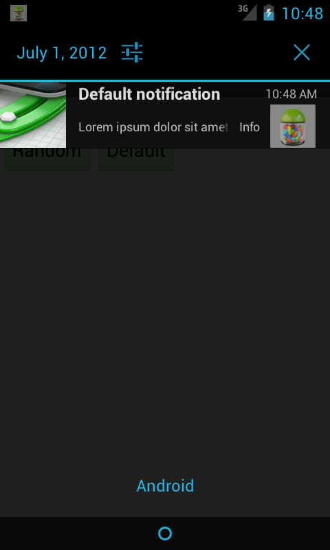

Jelly Bean Notification Test Suite
================================

This repository is designed to test Android 4.1 Jelly Bean's new Notification
API quite extensively. It adds the additional option of a number parameter so
a Notification can have a count (like most Email/ SMS apps do).

Changes
-------------------------

The PNG images are compressed/ optimized as well as an option was added to modify
the notification count/ number.

About Me
-------------------------

My email and PayPal :-) is contact @ tombarrasso [dot] com. I do independent
development in just about anything but my focus has always been the open
ecosystem of Google's Android OS.